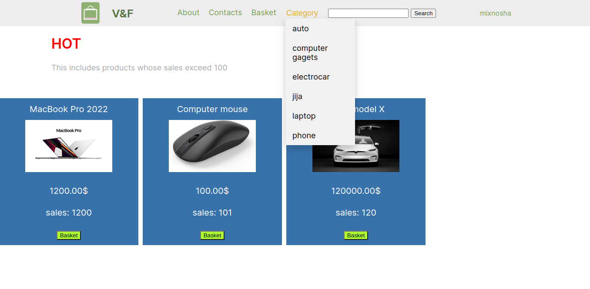
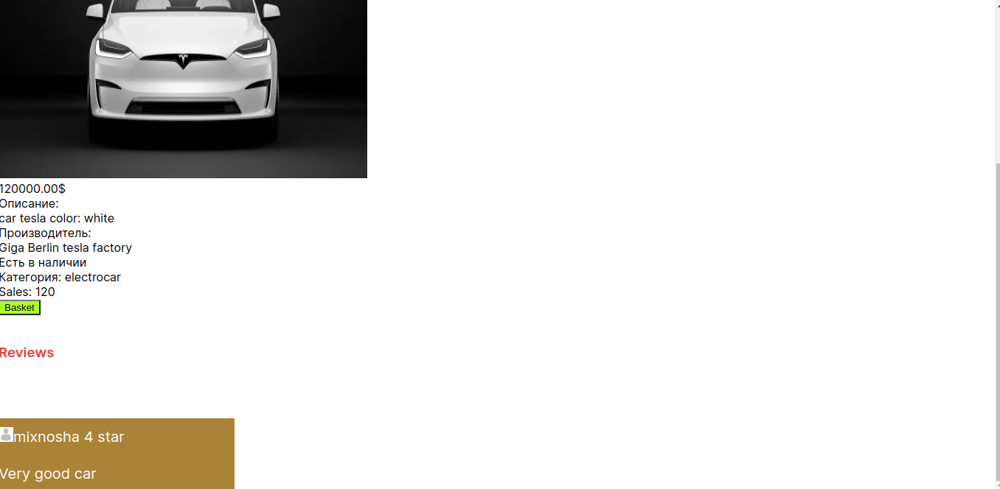
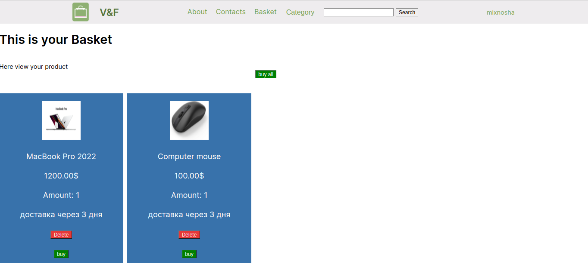
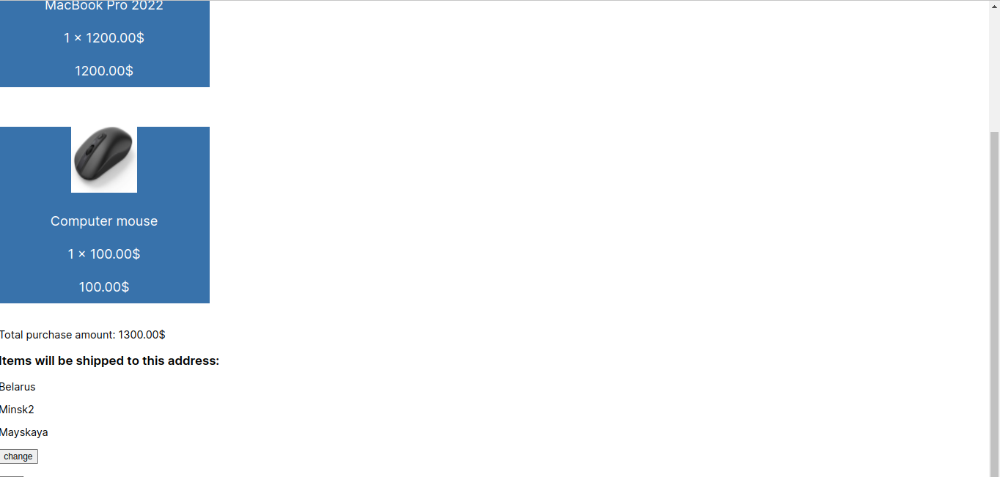
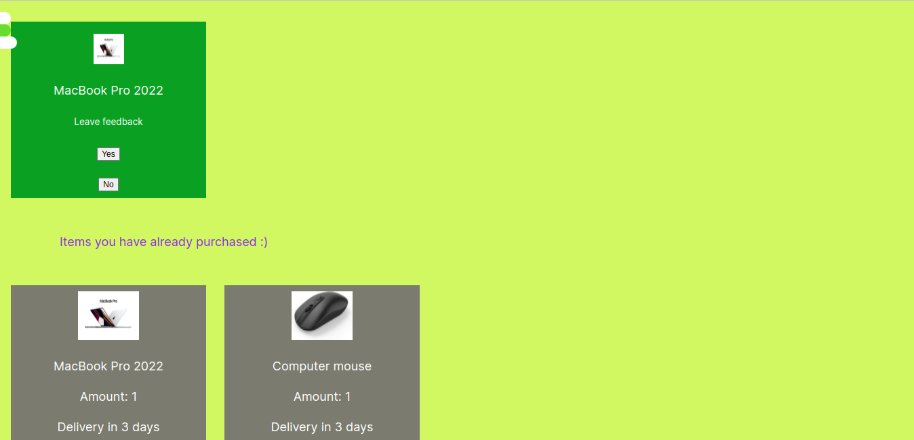
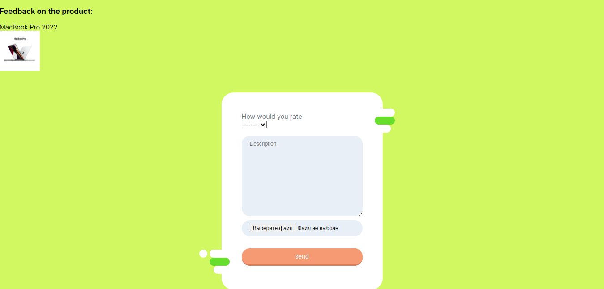
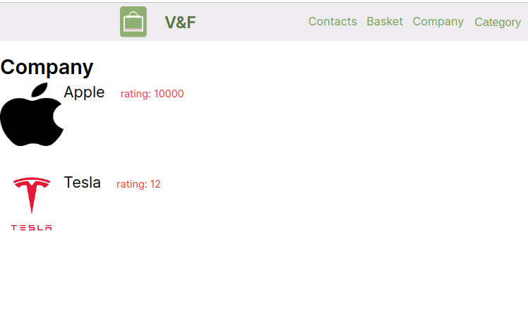
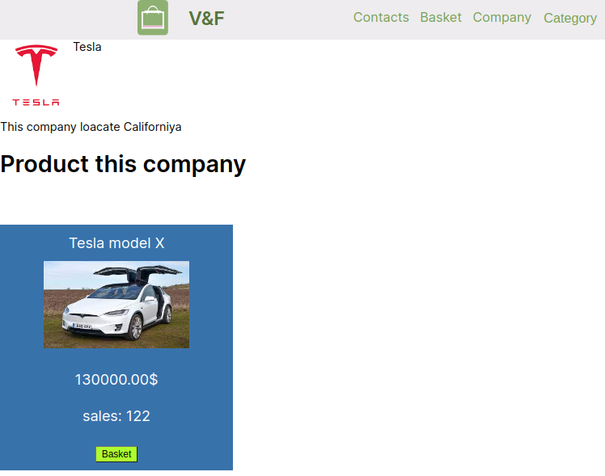

<h1 align="center">Online Store  🏪🌐📊 </h1>

#### This project is an online store written in Django.

###  [](https://git.io/typing-svg)

### 🛠 Demo version
  Main page


Producut page


Basket page


Buy all





Feedback


All company Page


Company Page



### 👷‍♂️Implemented on the site

* Registration system
* Personal Area
* Product Reviews
* Basket
* Product selection by category
* Product search by keywords


😕As you can see, this project lacks a front-end developer.\
I always welcome your suggestions.\
My mail: xmixho@gmail.com

### ⚙️Project setup

```
git clone https://github.com/Mixnosha/market.git
cd market/main_app
pip install -r requirements.txt
python manage.py migrate
python manage.py runserver
```
